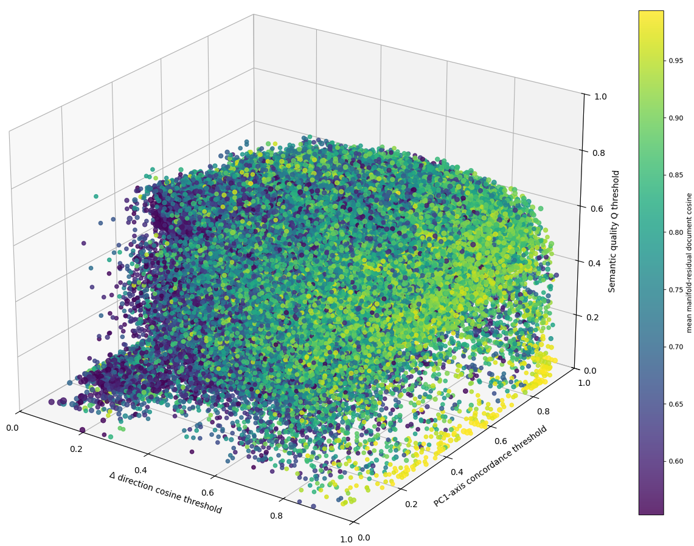
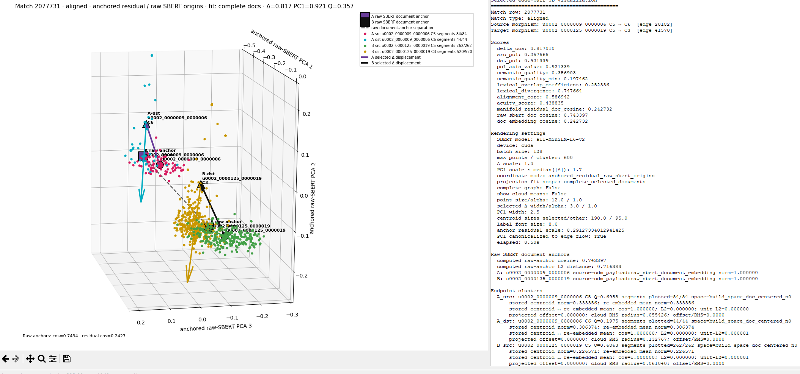
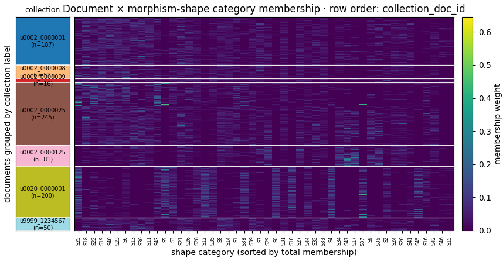
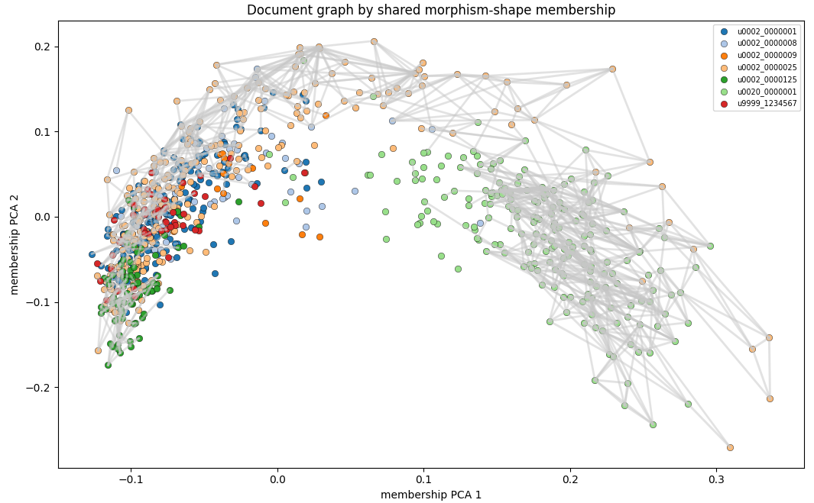
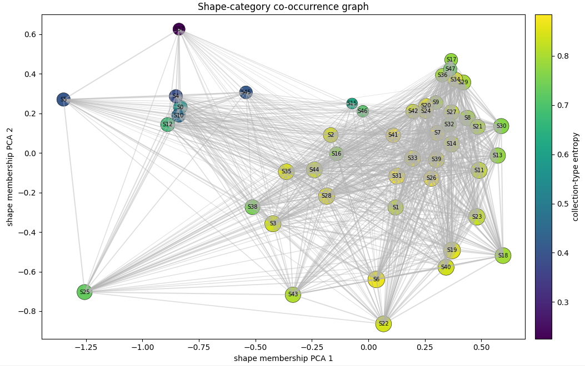
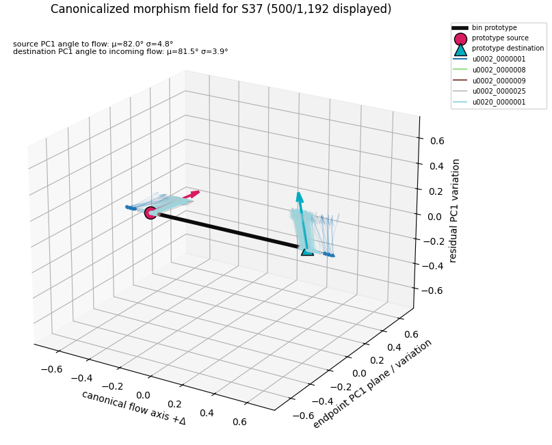
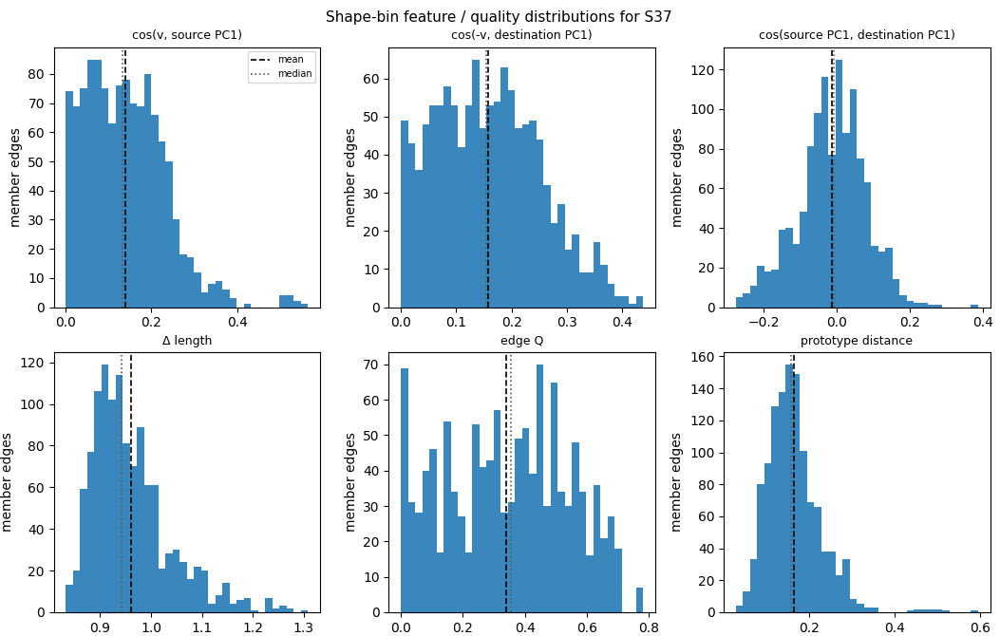
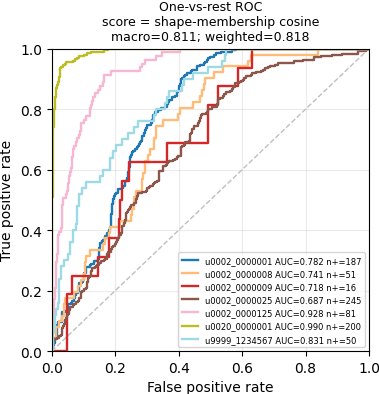
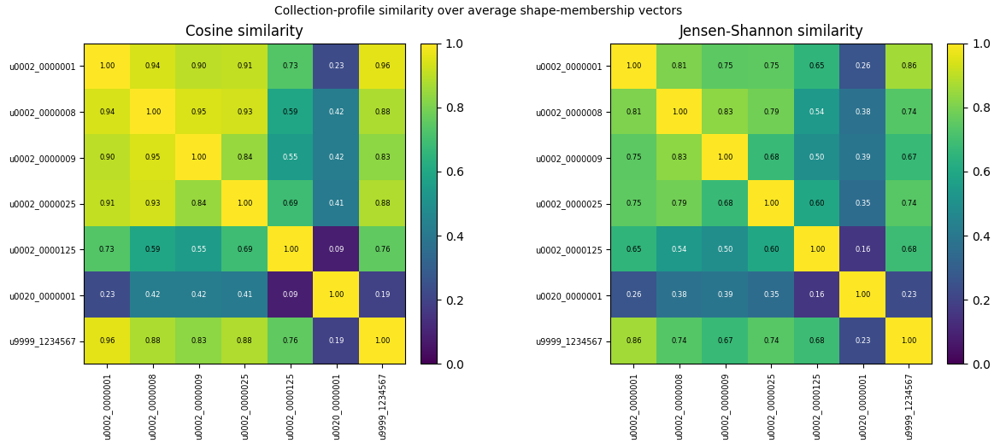
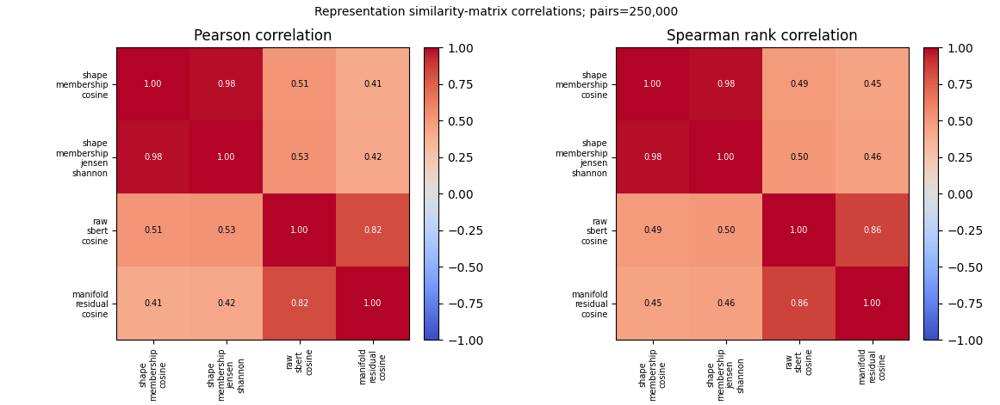

# Semantic Morphism Graph Analysis and Evidence Documentation Platform

Standalone Python 3.10 desktop application for inspecting, querying, visualizing, and documenting morphism comparisons and semantic transition graphlet and graphlet field artifacts produced by the **Embedding Manifolds as Semantic Morphisms** pipeline.

The application is designed for research review, and evidence documentation. It opens compact enriched pipeline artifacts directly and provides views for moving from millions of retained graphlet matches to inspectable examples, collection level arrangement profiles, ROC evaluation, and shape bin field characterization.

**Developer:** Jeremiah Colonna-Romano, University of Alabama Libraries Digital Services, 2025-2026

## Repository role

This application is the analysis and evidence layer for the semantic transition graphlet pipeline. It is not the OCR ingest system and it does not rebuild the pipeline’s embedding or clustering artifacts. Instead, it loads saved analysis products and companion artifacts such as:

- `morphism_comparison.pkl`
- `document_delta_dict.pkl`
- `segments_by_doc.pkl`
- `morphism_arrangement_experiment.pkl`
- exported arrangement/ROC/shape-neighbor CSV tables

The platform intentionally reads saved payloads directly rather than importing the pipeline modules. This makes it usable as a standalone review and exploratory analysis tool.

## Run

```bash
python morphism_analysis_platform.py
```

Open a comparison file at launch:

```bash
python morphism_analysis_platform.py path/to/morphism_comparison.pkl
```

## Install

```bash
pip install -r requirements_morphism_analysis_platform.txt
```

The application uses Tkinter for the desktop interface. On most standard Python.org Windows installations, Tkinter is included. Some Linux distributions require a package such as `python3-tk`.

For score browsing, schema inspection, table export, and plot-cache graph views, the core dependencies are `numpy` and `matplotlib`. `pandas` improves CSV/table export behavior but the application includes fallbacks for many table operations. The Edge Match 3D point-cloud view requires `sentence-transformers` because it re-embeds selected document segments on demand.

## Security note

Pickle files can execute arbitrary code when loaded. Open only `.pkl` files created by this project or received from trusted collaborators. For dissemination and long-term preservation, export CSV/JSON/Markdown/HTML/PNG evidence products as appropriate rather than relying on pickle alone.

## Data artifacts and what they enable

| Artifact | Purpose in the platform |
|---|---|
| `morphism_comparison.pkl` | Compact/enriched retained edge-match payload. Enables schema inspection, match querying, plot-cache graph views, candidate evidence browsing, and document-cosine/lexical/acuteness diagnostics when present. |
| `document_delta_dict.pkl` | Companion CDM geometry dictionary. Enables centroid, displacement, PC1, semantic quality, raw/residual document embedding, Edge Match 3D geometry, complete document graph context, and arrangement experiment construction. |
| `segments_by_doc.pkl` | Companion segment text dictionary. Enables cluster text evidence, lexical checks, and on-demand re-embedding of selected documents/clusters for Edge Match 3D point clouds. |
| `morphism_arrangement_experiment.pkl` | Saved arrangement experiment object. Enables shape-category atlas, membership heatmap, document/shape graphs, shape-neighbor inspection, shape-bin field workspace, collection summaries, and ROC baselines without rebuilding the experiment. |
| Arrangement CSV exports | Reviewable tables for shape summaries, representative edges, document membership, collection summaries, ROC rows, shape-neighbor tables, and shape-bin field summaries. |

The application can open `morphism_comparison.pkl` alone, but the richest evidence and visualization workflows require the companion `document_delta_dict.pkl` and `segments_by_doc.pkl` from the same pipeline batch.

## Large-file loading behavior

Large compact pickles are opened in staged mode. The application deserializes the pickle, refreshes schema and plot-cache metadata first, then waits for the user to explicitly run query tables, candidate refreshes, graph rendering, arrangement construction, or 3D views.

This design avoids freezing the Tkinter UI when opening comparison files containing millions of retained matches. Row-aligned NumPy fields are cached after load to avoid repeated conversion of large structured arrays.

## Main interface components

### 1. Schema inspector

The schema inspector verifies what is available in a loaded payload.

It reports:

- payload kind and version
- document, edge, and retained-match counts
- structured `matches` dtype fields
- `edge_index` fields
- `match_diagnostics` presence
- `plot_cache` presence and grid shape
- document-embedding table availability
- summary and parameter metadata
- recursive schema tree

Use this first after loading a new artifact to confirm whether it contains compact diagnostics, plot-cache arrays, raw/residual document cosines, and compatible edge metadata.

### 2. Match query workbench

The match query workbench filters retained morphism matches without rebuilding legacy CSV dictionaries.

Common filters include:

- source document
- target document
- any involved document
- match type: `aligned`, `pc1_only`, or any
- minimum Δ cosine
- minimum PC1-axis value
- minimum semantic quality Q
- minimum lexical divergence
- maximum lexical overlap
- minimum acuity score
- maximum manifold-residual document cosine
- maximum raw SBERT document cosine

The table displays edge IDs, source/target documents, source/destination cluster labels, match type, Δ, PC1, Q, lexical overlap/divergence, acuity, raw SBERT document cosine, and manifold-residual document cosine when available.

Rows can be exported as CSV/TSV and can be opened in the evidence browser or Edge Match 3D view.

### 3. Plot-cache graph views

The plot-cache graph views restore compact 3D match-field summaries from enriched `morphism_comparison.pkl` payloads.



Supported views include:

- retained match count field
- mean lexical overlap
- mean lexical divergence
- peak acuity
- acute candidate scatter
- lexical-overlap-as-Z / peak-acuity color view
- mean manifold-residual document cosine
- mean raw SBERT document cosine
- source/anchor edge contribution

The base graph axes are the morphism comparison field:

```text
X = Δ direction cosine
Y = selected PC1-axis concordance
Z = semantic quality Q
```

The graph views use precomputed compact `plot_cache` arrays when available and avoid reconstructing legacy match dictionaries.

### 4. Candidate evidence browser

The evidence browser presents high-value retained matches as documentation-ready evidence packets.

It can use cached `plot_cache["top_candidates"]` or fall back to acuity-ranked retained matches. Evidence packets include:

- source and target document IDs
- source/destination cluster labels for both matched edges
- match type
- Δ cosine
- source PC1 and destination PC1 scores
- selected PC1-axis value
- semantic quality and semantic quality minimum
- lexical overlap and lexical divergence
- alignment core and acuity score
- manifold-residual document cosine
- raw SBERT document cosine
- cluster text excerpts when `segments_by_doc.pkl` is loaded
- companion lexical summaries where available

Packets can be exported as Markdown or JSON for presentation, publication, proposal, or audit documentation.

### 5. Edge Match 3D

The Edge Match 3D tab renders one selected retained match as an inspectable two-document morphism diagram.



Workflow:

1. Open `morphism_comparison.pkl`.
2. Open companion `document_delta_dict.pkl`.
3. Open companion `segments_by_doc.pkl`.
4. Run a query in the match query workbench.
5. Select a row and click **Open selected in 3D**.
6. Click **Render** in the Edge Match 3D tab.

The view re-embeds only the two selected documents or selected endpoint clusters using SentenceTransformers. It reconstructs the pipeline’s document-centered residual build space and draws:

- four endpoint cluster point clouds for the selected source/target morphisms
- stored cluster centroids
- source→destination displacement arrows Δ
- endpoint PC1 arrows
- optional centroid diagnostic overlays
- optional complete two-document graph context

#### Coordinate modes

- `residual_cdm_space`: draws geometry in reconstructed document-centered CDM residual space.
- `anchored_residual_raw_sbert_origins`: translates residual CDM glyphs to raw mean SBERT document anchors, showing raw document proximity and local morphism action in one view.

#### Complete document graph option

The **Complete document graph for selected match** option renders all clusters and directed cluster-to-cluster displacement arrows for the two selected documents, while highlighting the selected matched morphism edges.

Presentation-legibility controls include:

- show all Δ arrows
- show all PC1 arrows
- label mode: none, selected, all
- cloud mean overlay
- edge filter: all, top length, top quality, top flow
- maximum arrows per document
- all-Δ alpha and width
- selected-Δ width and alpha
- point size and alpha
- PC1 width
- selected and non-selected centroid sizes
- label font size

#### Projection fit controls

The PCA projection fit can be scoped to:

- `selected_edge_endpoints`: keep the selected edge-pair projection stable while adding context.
- `displayed_objects`: fit PCA to everything currently drawn.
- `complete_selected_documents`: fit PCA to all two-document cluster clouds and centroids while avoiding hidden/filtered arrows dominating the projection.

Projection affects display only. Full-dimensional match scores are computed by the pipeline before visualization.

### 6. Arrangement experiment

The Arrangement experiment tab turns a `document_delta_dict.pkl` into a collection-level morphism-shape membership experiment. It extracts directed intra-document morphism edges, computes edge-local shape descriptors, clusters those descriptors into shape bins, and builds a document × shape-category membership matrix.

Core controls include:

- `shape_k`
- `include_length`
- `include_v_bin`
- `dir_weight_beta`
- `max_edges_per_doc`
- `min_weight`
- `weight_mode`: weighted or count
- normalize membership
- similarity metric: cosine or Jensen-Shannon
- document top-k neighbors
- shape support threshold
- collection label source: prefix, regex, metadata CSV, or none

The current default regex for two-part collection IDs is:

```regex
^([^_]+_[^_]+)_
```

For `u0002_1234567_0000002_0001`, this extracts `u0002_1234567`.

For more detail, see `morphism_analysis_platform_arrangement_README.md`.

## Arrangement experiment sub-workspaces

The Arrangement experiment tab contains the following subviews.

### Summary

Reports dataset size, document count, collection labels, shape count, extracted edge count, membership matrix shape, and parameter settings.

### Shape atlas / representative edges

Lists learned shape bins with:

- edge count
- document support
- top collection type
- collection entropy
- mean edge weight
- mean edge quality
- mean displacement length
- centroid feature values

Representative edges are shown for the selected shape category.

### Membership heatmap and similar documents



Shows documents by shape-category membership weight. The heatmap has:

- shape bins on the X axis
- documents on the Y axis
- cell color = membership weight
- collection label strip and block boundaries on the left
- selectable row ordering
- live rollover with document ID, collection label, shape ID, and membership value

Row-order options include:

- collection + dominant shape
- collection + document ID
- document ID
- dominant shape
- membership PCA
- collection + membership PCA
- random within collection

A selected document can be used to list nearest documents by shape-membership similarity.

### Document graph by shared shape membership



Builds a top-k document graph where nodes are documents and edges represent similarity between document shape-membership profiles. This graph represents shared morphism-action composition rather than raw SBERT document proximity.

### Shape-category co-occurrence graph



Builds a graph where nodes are shape bins and edges indicate co-occurrence in the same documents above the support threshold. This reveals bundles of morphism-action categories that tend to occur together.

### Shape neighbor inspector

Computes and displays three kinds of shape-neighbor relationships:

- centroid nearest neighbors in shape-feature space
- co-occurrence neighbors based on shared document support
- collection-profile neighbors based on collection-level membership distributions

This helps determine whether apparent substitutions among top shape IDs are geometrically related, co-occurring, or collection-profile analogues.

### Shape Bin Field workspace



Inspects a selected shape bin as a morphism field. It provides:

- canonicalized morphism field visualization
- residual-space morphism context visualization
- feature/quality/prototype-distance distributions
- collection composition charts
- member edge table
- scientific report



The workspace characterizes five scientifically valuable features:

1. generic vs collection-specific shapes
2. tight vs loose shape families
3. semantically broad but structurally stable bins
4. recurring asymmetries in transition structure
5. bin stratification by collection family

### Collection summary

Reports collection-level profiles, top shapes, dominant-shape distributions, collection-profile similarity matrices, and collection-level shape signatures.

### Collection ROC



Evaluates whether representation domains recover collection labels. It includes:

- one-vs-rest ROC curves for shape membership
- one-vs-rest baseline comparisons across representation domains
- pairwise same-collection vs cross-collection ROC curves
- similarity matrix correlation panels



Representation domains include, when available:

- raw SBERT document cosine
- manifold-residual document cosine
- shape-membership cosine
- shape-membership Jensen-Shannon similarity



The correlation panel compares document-pair similarity score vectors across representation domains using Pearson and Spearman correlations.

## Export products

The Arrangement experiment can save a reusable `morphism_arrangement_experiment.pkl` and export tables such as:

- `shape_summary.csv`
- `representative_edges.csv`
- `collection_summary.csv`
- `doc_shape_membership.csv`
- `dominant_shape_distribution.csv`
- `collection_profile_similarity_pairs.csv`
- `collection_shape_profile_matrix.csv`
- `shape_centroid_neighbors.csv`
- `shape_cooccurrence_neighbors.csv`
- `shape_collection_profile_neighbors.csv`
- `shape_bin_field_summary.csv`
- `collection_roc_all_rows.csv`
- `collection_roc_one_vs_rest.csv`
- `collection_roc_pairwise.csv`
- `collection_roc_similarity_correlations.csv`

## Conceptual terminology used by the application

### Raw SBERT document cosine

Cosine similarity between raw mean SBERT document embeddings. This is the global document-semantic baseline.

### Manifold-residual document cosine

Cosine similarity between document-centered residual manifold document embeddings. This is a document-level residual-organization baseline.

### Morphism edge

A directed source-cluster → destination-cluster displacement inside a document CDM.

### Shape bin

A learned category of morphism-edge form. With `include_v_bin=false`, shape bins are based primarily on edge-local relationships among displacement direction, source PC1, destination PC1, and optional displacement length. They are not topics and not raw semantic clusters.

### Shape membership profile

A document-level vector over learned shape bins. With normalize membership on, it is a distribution over the kinds of morphism-action forms found in the document.

### Acuity

A diagnostic score emphasizing strong morphism alignment combined with lexical divergence. It helps identify examples where similar semantic action appears under different vocabulary.

## Recommended review workflow

1. Open `morphism_comparison.pkl` and inspect schema.
2. Open companion `document_delta_dict.pkl` and `segments_by_doc.pkl`.
3. Query retained matches and inspect evidence packets.
4. Use Edge Match 3D to visualize selected match examples.
5. Build or load an Arrangement experiment from `document_delta_dict.pkl`.
6. Inspect shape atlas, heatmap, document graph, and collection summary.
7. Use Shape Neighbor Inspector and Shape Bin Field for individual shape-bin interpretation.
8. Use Collection ROC and representation baselines to compare raw SBERT, residual document, and shape-membership signals.
9. Export tables and evidence packets for review, slides, papers, or proposal materials.

## Limitations and interpretation cautions

- PCA projection affects display only and can change visual placement depending on the points included in the projection fit.
- Shape bins learned from the current batch are batch-local categories. For cross-run absence/presence claims, use or develop a fixed reference atlas.
- ROC scores are ranking evaluations, not calibrated probabilities.
- Shape membership is derived from SBERT-based CDM geometry and should be evaluated as a structural abstraction, not as independent of embeddings.
- `include_v_bin=true` adds a coordinate-dependent coarse displacement-direction component to the shape features and can change the interpretation of shape bins.
- Pickle files are trusted-local research artifacts, not preservation-safe dissemination formats.
